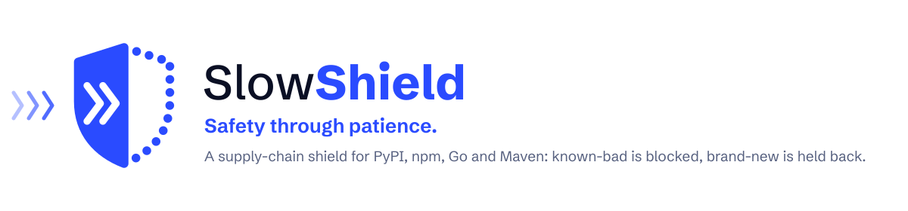

<p align="center">
  <picture>
    <source media="(prefers-color-scheme: dark)" srcset="brand/readme-banner-dark.svg">
    
  </picture>
</p>

SlowShield is a supply-chain defence proxy for **PyPI** and **npm**. It sits between your developers,
CI and production builds and the public registries, and:

- **holds new releases back** for a configurable number of days (default 7), so the community and the
  threat feeds have time to notice a compromised version before you install it;
- **blocks known-malicious packages** from the OpenSSF/OSV and GitHub Advisory malware feeds
  (HTTP 451, even when failing open);
- **detects tampering**: every artifact is verified against the registry's published digests *and* its
  first-seen fingerprint; if the bytes ever change, the download is aborted mid-stream;
- **shows you what you depend on**: a fast, read-only web UI with installs, trends, new dependencies,
  held-back versions and a security timeline — plus OpenTelemetry metrics, logs and traces with
  ready-made Grafana dashboards and alerts.

```
pip / uv / poetry / npm / pnpm / yarn / bun
                 │  HTTPS (TLS 1.3, HTTP/2, HTTP/3)
                 ▼
          Caddy (TLS, H3)  ──────────────── certificates: ACME, your files, or internal CA
                 │
          SlowShield (Python 3.15, Granian)
          ├─ blocklist      OSV + GitHub malware advisories (sync every hour)
          ├─ release age    per file (PyPI) / per version (npm), exceptions, fail-open
          ├─ integrity      registry digests + trust-on-first-use fingerprint, verified cache
          └─ telemetry      OTLP → Alloy → Prometheus / Loki / Tempo → Grafana
                 │  HTTP/2
                 ▼
     pypi.org · files.pythonhosted.org · registry.npmjs.org
```

## Quick start

Try it on your laptop: one container, plain HTTP on localhost, nothing kept after you stop it.

```bash
docker run --rm -p 127.0.0.1:8080:8080 ghcr.io/squirro/slowshield:latest
```

The dashboard is at `http://localhost:8080`. In a second terminal, install something through it (in a throwaway
virtualenv, because Homebrew and current Linux Pythons refuse pip installs outside one):

```bash
python3 -m venv /tmp/slowshield-try
/tmp/slowshield-try/bin/pip install --index-url http://localhost:8080/pypi/simple/ requests
```

Releases younger than a week are held back; known malware is refused with HTTP 451. To send pip, uv and npm
through it in every new terminal (bash on Linux shown; on macOS bash reads `~/.bash_profile` and zsh
`~/.zshrc`; in fish use `set -Ux NAME value`):

```bash
cat >> ~/.bashrc <<'EOF'
export PIP_INDEX_URL=http://localhost:8080/pypi/simple/
export UV_DEFAULT_INDEX=http://localhost:8080/pypi/simple/
export npm_config_registry=http://localhost:8080/npm/
EOF
source ~/.bashrc
```

Remove the lines to switch it off.

## Run it for your team

```bash
git clone https://github.com/squirro/slowshield
cd slowshield/deploy/docker
cp .env.example .env              # your hostname, TLS mode, optional GITHUB_TOKEN
docker compose up -d
# with the full Grafana stack:
docker compose -f compose.yaml -f compose.observability.yaml up -d
```

Caddy in front handles TLS (ACME, your own certificates, or an internal CA for testing). Podman (rootless
Quadlet) and Kubernetes (Helm) setups live in [`deploy/podman`](deploy/podman/README.md) and
[`deploy/helm`](deploy/helm/slowshield/README.md); every variant has an observability flavour. Images:
`ghcr.io/squirro/slowshield` and `ghcr.io/squirro/slowshield-caddy` (amd64 and arm64, SBOM and provenance
attached); pin a release or a digest in production.

## Point your clients at it

```bash
pip config set global.index-url https://slowshield.example.com/pypi/simple/
export UV_DEFAULT_INDEX=https://slowshield.example.com/pypi/simple/
npm config set registry https://slowshield.example.com/npm/
```

The UI's **Setup** page renders ready-to-copy snippets for pip, uv, Poetry, PDM, Pipenv, npm, pnpm, Yarn
and Bun with your hostnames. Per-ecosystem hostnames (`pypi.example.com/simple/`,
`npm.example.com/`) are supported too.

What clients see:

| Situation | Index / packument | Direct download (lockfile) |
|---|---|---|
| version older than the delay | listed | `200` (verified, cached) |
| version younger than the delay | hidden; `latest` points at the newest allowed | `403` + `Retry-After` |
| no version old enough yet (brand-new package) | all non-blocked versions (*fail-open*, recorded) | `200` |
| package or version on the malware blocklist | removed (`451` if nothing is left) | `451` with the advisory |
| bytes differ from the registry digest or first-seen fingerprint | — | stream aborted, event recorded, later `451` |

## Threat feeds

| Feed | Token | Notes |
|---|---|---|
| OSV / OpenSSF malicious packages | none | full snapshot once, then incremental via `modified_id.csv` |
| GitHub Advisory Database (malware) | `GITHUB_TOKEN` (fine-grained PAT, no permissions) | without a token the feed is **off**, the UI shows how to enable it, and `slowshield_feed_enabled{reason="missing_token"}` lets you alert on it |

## Configuration

Everything works with defaults plus a few environment variables; `config.toml` (see
[`config.example.toml`](config.example.toml)) adds exceptions and tuning. Policy changes are applied
live. Reference: [docs/configuration.md](docs/configuration.md).

## Security

- Containers: Amazon Linux 2023 only (builders included), distroless runtime (no shell, no package
  manager, RPM database kept for scanners), non-root UID 65532, read-only root filesystem, all
  capabilities dropped, `no-new-privileges`, multi-arch (amd64/arm64).
- TLS by Caddy: TLS 1.3 only by default, hybrid post-quantum key exchange (X25519MLKEM768), HTTP/3, HSTS.
- UI: strict Content-Security-Policy (no inline script/style), every value escaped, read-only.
- Supply chain of SlowShield itself: locked & hashed dependencies (`uv.lock`), digest-pinned base images,
  SHA-pinned GitHub Actions audited by `zizmor --persona=pedantic`, Dependabot with a 7-day cooldown,
  SBOM + provenance attestations on every image.

See [docs/security.md](docs/security.md) and [SECURITY.md](SECURITY.md) for the threat model and how to
report a vulnerability.

## Performance

Async Python 3.15 on [Granian](https://github.com/emmett-framework/granian) (Rust HTTP server) with
[pyreqwest](https://github.com/MarkusSintonen/pyreqwest) (Rust reqwest/hyper, HTTP/2 upstream) and
[msgspec](https://github.com/jcrist/msgspec). npm packuments are filtered without decoding version
manifests; cached artifacts are sent zero-copy. Every release is load-tested against the previous one on
the same runner and blocked on regressions — see [perf/README.md](perf/README.md).

## Development

```bash
uv sync                       # creates .venv with Python 3.15
uv run pytest                 # unit + integration tests (fake registries, no network)
uv run ruff check && uv run ruff format --check && uv run ty check
cp .env.example .env && uv run slowshield serve --config config.example.toml
```

More in [CONTRIBUTING.md](CONTRIBUTING.md) and [docs/development.md](docs/development.md).

## License

Apache License 2.0 — see [LICENSE](LICENSE) and [NOTICE](NOTICE). If you distribute a modified version,
please give it a different name and logo ([brand/README.md](brand/README.md#name-and-logo)).
